# Messyer Raytracer — Project Roadmap

> A Godot 4.6 GDExtension implementing a real-time ray tracer in C++ with
> GPU compute (Vulkan), BVH acceleration, SIMD, and a hybrid rendering pipeline.

---

## Table of Contents

- [Project Vision](#project-vision)
- [Architecture Overview](#architecture-overview)
- [What We Have Today](#what-we-have-today)
- [Known Deficiencies](#known-deficiencies)
- [Roadmap](#roadmap)
  - [Phase 1 — Visual Quality Foundations](#phase-1--visual-quality-foundations)
  - [Phase 2 — BVH Upgrade (TinyBVH)](#phase-2--bvh-upgrade-tinybvh)
  - [Phase 3 — Multi-Bounce Path Tracing](#phase-3--multi-bounce-path-tracing)
  - [Phase 4 — Denoising](#phase-4--denoising)
  - [Phase 5 — Production Ship](#phase-5--production-ship)
- [Landscape Analysis](#landscape-analysis)
- [CompositorEffect Technical Reference](#compositoreffect-technical-reference)
- [PBR & Shading Reference](#pbr--shading-reference)
- [GPU Shader Reference](#gpu-shader-reference)
- [Risk Register](#risk-register)

---

## Project Vision

Build a **cross-vendor, Vulkan compute** ray tracer as a Godot GDExtension that:

1. **Hybrid renders** — Godot's Forward+ rasterizer handles primary visibility and PBR shading; our ray tracer adds RT reflections, AO, shadows, and GI as `CompositorEffect` passes.
2. **Works on any Vulkan GPU** — no DXR, no RTX cores, no DLSS required. Runs on GTX 1650 Ti, AMD RDNA, Intel Arc alike.
3. **Serves gameplay** — LOS queries, ballistic ray tests, AI perception cones, audio occlusion — all from the same BVH.
4. **Ships in a real game** — performance budgets, LOD, async BVH rebuild, resolution scaling.

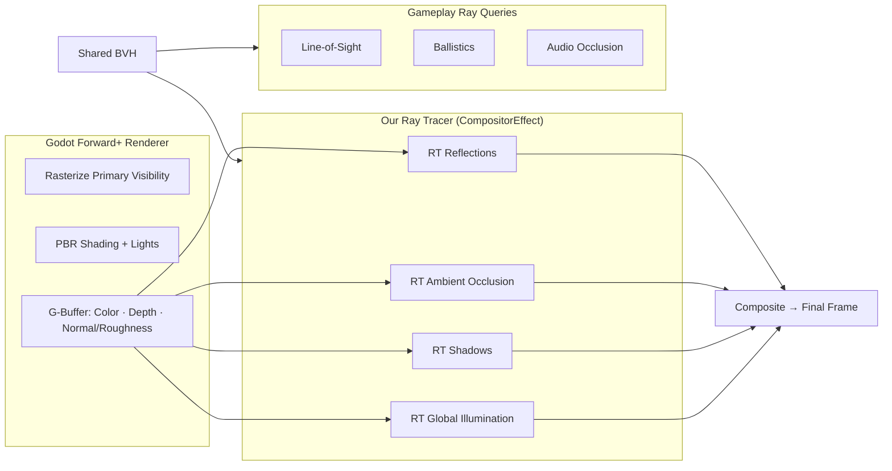

---

## Architecture Overview

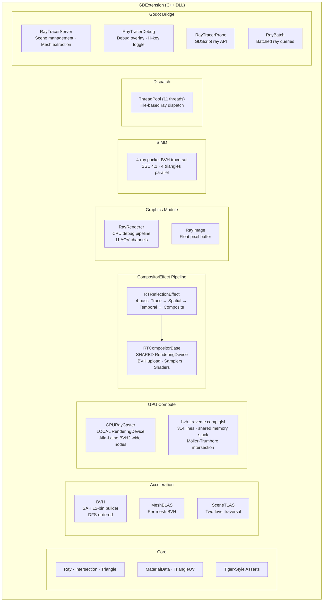

### Dual-Device Architecture

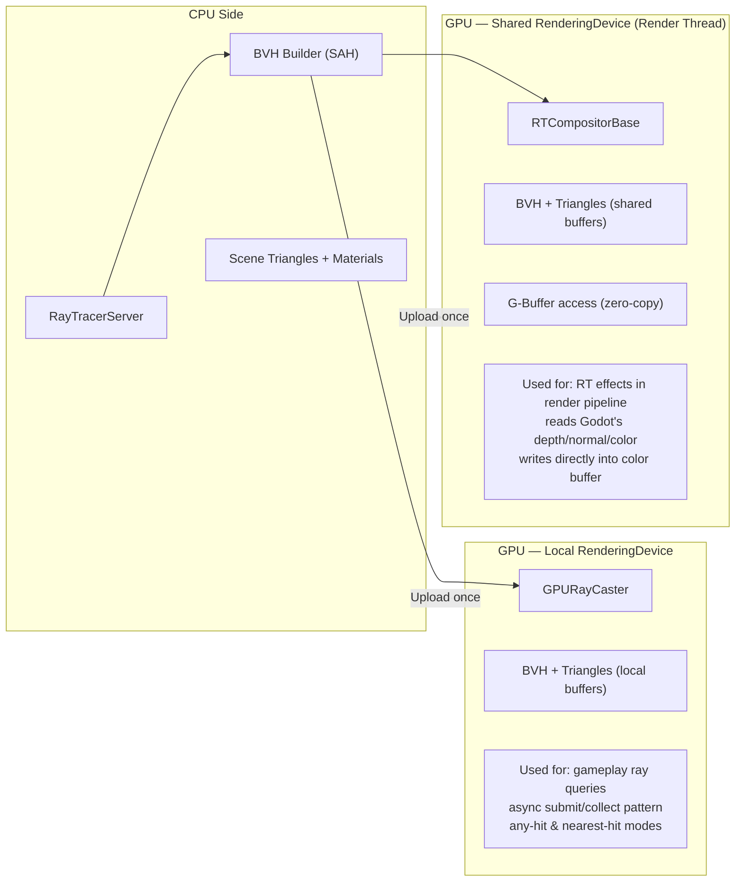

---

## What We Have Today

### Completed (Phases 1–5 of old plan)

| Feature | Status | Key Stats |
|---------|--------|-----------|
| **BVH acceleration** | ✅ | SAH 12-bin builder, DFS-ordered, Aila-Laine wide nodes on GPU, MAX_LEAF_SIZE=4 |
| **GPU compute traversal** | ✅ | Vulkan 450, 128-thread workgroups, shared memory stack (24KB), MAX_ITERATIONS=65536 |
| **SIMD CPU traversal** | ✅ | SSE 4.1, 4-ray packets, 4-triangle parallel intersection |
| **Thread pool dispatch** | ✅ | 11 threads, tile-based, frame-coherent sorting |
| **TLAS/BLAS** | ✅ | Two-level traversal, per-mesh BLASes, ray transform |
| **Material extraction** | ✅ | Albedo, metallic, roughness, specular, emission from `BaseMaterial3D` |
| **UV + texture sampling** | ✅ | Per-triangle UVs, nearest + bilinear sampling |
| **11 AOV debug channels** | ✅ | Color, Normal, Depth, Barycentrics, Position, PrimID, HitMask, Albedo, Wireframe, UV, Fresnel |
| **GPU async dispatch** | ✅ | submit_async / collect pattern for CPU overlap |
| **Any-hit queries** | ✅ | Early-exit traversal for shadow/occlusion |
| **Debug overlay** | ✅ | H-key toggle, resolution selector (640→1920) |
| **register_scene() auto-discover** | ✅ | Walk subtree, register all MeshInstance3D nodes |
| **RTCompositorBase** | ✅ | Shared device BVH upload, samplers, shader compiler, dispatch helpers |
| **RTReflectionEffect** | ✅ | 4-pass pipeline: RT trace → spatial denoise → temporal accum → composite |

### Current Performance (13 meshes, 13,514 triangles)

| Backend | Resolution | Frame Time |
|---------|-----------|------------|
| CPU (SSE + ThreadPool) | 1280×960 | ~45 ms |
| GPU (Vulkan compute) | 1280×960 | ~55 ms |

### Scene Capabilities
- 13 meshes, 13,514 triangles (Cornell box variant)
- Single directional sun light
- Lambert-only shading (PBR data stored but **not consumed** except albedo)
- Primary rays only — no shadow rays, no bounces, no environment lighting

---

## Known Deficiencies

Compared to production ray tracers (Lighthouse 2, unity-tinybvh, TinyBVH, JenovaRTX):

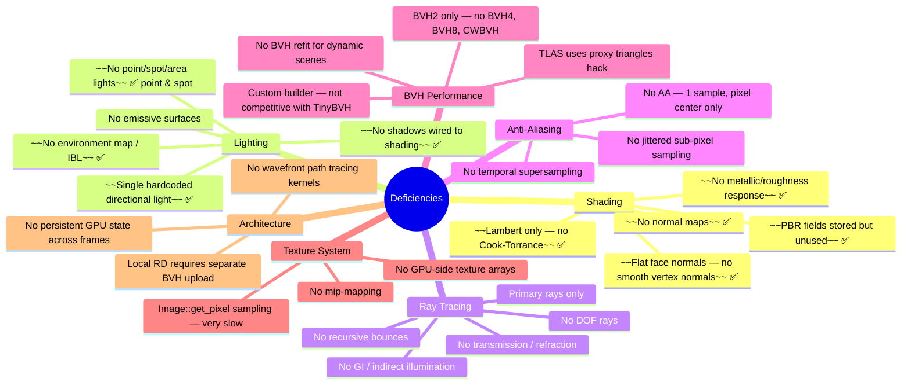

---

## Roadmap

### Phase 1 — Visual Quality Foundations

> **Goal**: Make the existing pipeline produce noticeably better images
> before touching the BVH or adding bounces.

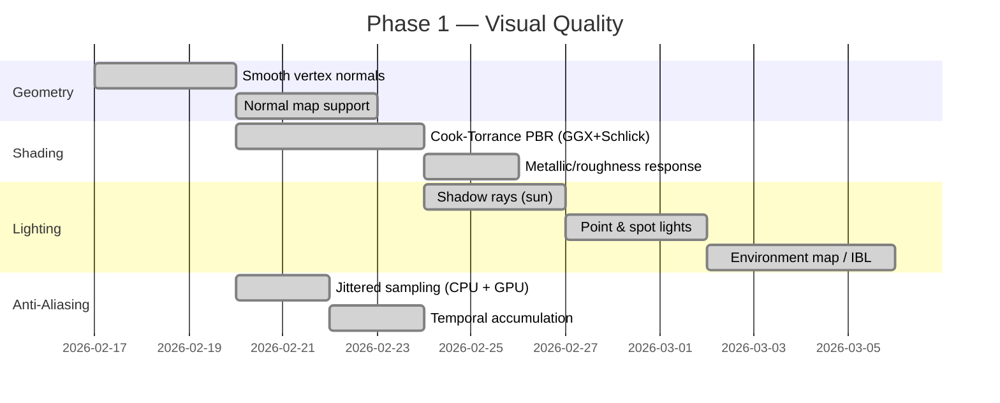

#### 1.1 — Smooth Vertex Normals ✅

**Problem**: We use flat face normals from the triangle cross product. Every facet is visible.

**Solution**: Extract `ARRAY_NORMAL` from Godot mesh surfaces during `_extract_object_triangles()`, store per-vertex normals in `Triangle` or a parallel array, and interpolate at hit point using barycentrics.

```
hit_normal = normalize(n0 * (1 - u - v) + n1 * u + n2 * v)
```

**Files**: `raytracer_server.cpp` (extraction), `core/triangle.h` (storage), `shade_pass.h` (interpolation), `bvh_traverse.comp.glsl` (GPU storage + interpolation)

#### 1.2 — Cook-Torrance PBR ✅

**Problem**: `shade_pass.h` uses Lambert (N·L + 0.08 ambient). `MaterialData` stores metallic/roughness/specular but they're never read.

**Solution**: Implement the standard microfacet BRDF:

$$f_r = \frac{D \cdot F \cdot G}{4 \cdot (N \cdot L)(N \cdot V)}$$

Where:
- $D$ = GGX/Trowbridge-Reitz normal distribution
- $F$ = Fresnel-Schlick: $F_0 + (1 - F_0)(1 - \cos\theta)^5$
- $G$ = Smith height-correlated masking-shadowing

**Files**: `shade_pass.h` (new `shade_pbr()` function), `material_data.h` (already has fields)

#### 1.3 — Shadow Rays ✅

**Problem**: No shadows anywhere. The `any_hit` GPU mode exists but isn't wired to shading.

**Solution**: For each primary hit, trace a shadow ray toward the sun direction. Use the `ANY_HIT` BVH traversal mode for early exit. If occluded → zero direct light contribution.

**CPU path**: Use existing `cast_rays_any_hit()`.
**GPU path**: Add a second dispatch pass in the render loop or pack shadow queries into the same dispatch.

#### 1.4 — Environment Map / IBL ✅

**Problem**: Miss rays return black. No sky, no ambient lighting from an HDR environment.

**Solution**: Detect `PanoramaSkyMaterial` on the Environment's Sky. Load the equirectangular HDR panorama as RGBAF32, cache it (re-fetched only on texture resource change). For miss rays, sample the panorama via equirectangular direction→UV mapping with bilinear interpolation. For shading, sample the panorama in the surface normal direction as a basic diffuse IBL approximation. Full importance-sampled specular IBL deferred to Phase 2+.

**Implementation details**:
- `EnvironmentData` extended with `panorama_data` (raw RGBAF32 pointer), `panorama_width`, `panorama_height`, `panorama_energy`
- `sample_panorama()` in `shade_pass.h` — bilinear sampling on raw float pointer, no Godot headers
- `direction_to_equirect_uv()` — longitude/latitude mapping: `u = atan2(x,z)/(2π) + 0.5`, `v = acos(y)/π`
- `sky_color()` checks panorama first, falls back to analytic ProceduralSky gradient
- Ambient section of `shade_material()` samples panorama in normal direction when available
- Panorama Image cached in `ray_renderer.h`, invalidated by `Object::get_instance_id()` check

#### 1.5 — Anti-Aliasing (Jitter + Temporal Accumulation) ✅

**Problem**: 1 sample per pixel at exact pixel center → hard aliased edges.

**Solution**: 
- **Jittered sub-pixel sampling**: Offset ray origin by random sub-pixel amount each frame (stratified or Halton sequence).
- **Temporal accumulation**: Running average across frames when camera is stationary.

```glsl
vec4 accumulated = prev * (frame - 1.0) / frame + new_sample / frame;
```

Invalidate accumulation on camera move.

#### 1.6 — Normal Map Support ✅

**Problem**: Smooth vertex normals give rounded silhouettes but surfaces lack fine detail (bricks, scratches, fabric weave). Godot materials with `FEATURE_NORMAL_MAPPING` and a `TEXTURE_NORMAL` are ignored.

**Solution**: Extract `ARRAY_TANGENT` (4 floats per vertex: xyz tangent + w bitangent sign) during `_extract_object_triangles()`. Store per-triangle tangents in a parallel `TriangleTangents` array. At shade time, build TBN matrix from interpolated tangent + Gram-Schmidt re-orthogonalized normal + cross-product bitangent, sample the normal texture, decode from [0,1] to [-1,1], apply `normal_scale`, and transform from tangent space to world space.

**Files**: `core/triangle_tangents.h` (new — storage), `api/material_data.h` (normal texture fields), `api/scene_shade_data.h` (tangent pointer), `godot/raytracer_server.cpp` (extraction + flattening), `modules/graphics/shade_pass.h` (`perturb_normal()` + integration into `shade_material()` and `shade_normal()` AOV)

#### 1.7 — Point & Spot Lights ✅

**Problem**: Only a single `DirectionalLight3D` sun is supported. `OmniLight3D` and `SpotLight3D` in the scene are ignored — no positional lighting, no spot cones.

**Solution**: Discover all light types from the scene tree per frame (three-tier NodePath pattern). Store up to `MAX_SCENE_LIGHTS` (16) in a `SceneLightData` struct with per-light type, position, direction, color×energy, range, attenuation exponent, spot angle, and shadow flag. Multi-light shadow rays: for each light, generate shadow rays from hit points toward the light (directional = constant direction, point/spot = toward position with distance clamp). Single batched any-hit dispatch for all lights. In `shade_material()`, loop over all lights computing per-light direction, Godot-matching distance attenuation $(\max(1 - (d/r)^2, 0))^{\text{exp}}$, spot cone falloff, and the existing Cook-Torrance BRDF per light.

**Files**: `api/light_data.h` (new — `LightData` + `SceneLightData`), `modules/graphics/ray_renderer.h` (`_resolve_all_lights()`, updated signatures), `modules/graphics/ray_renderer.cpp` (light discovery, multi-light shadow rays, plumbing), `modules/graphics/shade_pass.h` (multi-light shading loop, `compute_distance_attenuation()`, `compute_spot_attenuation()`, updated `ShadowContext`)

---

### Phase 2 — BVH Upgrade (TinyBVH)

> **Goal**: Replace our custom BVH with [TinyBVH](https://github.com/jbikker/tinybvh)
> for 2-3× GPU speedup via CWBVH and ~40% CPU speedup via BVH4/BVH8.

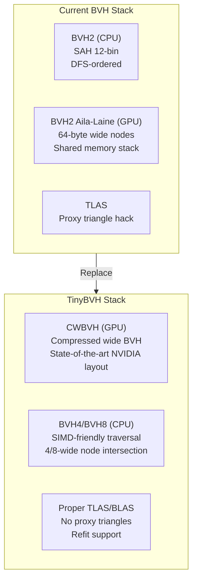

#### Why TinyBVH?

[TinyBVH](https://github.com/jbikker/tinybvh) is a single-header BVH library by Jacco Bikker (author of the Lighthouse 2 path tracer):

| Feature | Our Current | TinyBVH |
|---------|------------|---------|
| Build quality | SAH 12-bin | SAH binned (same) + SBVH (better) |
| GPU format | Aila-Laine BVH2 (64B/node) | CWBVH (compressed, ~1.5-2× faster) |
| CPU format | BVH2 + SIMD packet | BVH4, BVH8 (native SIMD width) |
| TLAS | Proxy triangles | Proper TLAS with instance transform |
| Refit | None | O(N) refit for dynamic scenes |
| Maintenance | Our code | Battle-tested, actively maintained |

#### Integration Plan

1. **Drop in `tiny_bvh.h`** — single-header, ~15K lines, MIT license
2. **Replace `BVH` class** with `tinybvh::BVH` as builder, convert to `tinybvh::BVH_GPU` for Aila-Laine (backward compatible) or `tinybvh::BVH8_CWBVH` for maximum GPU perf
3. **Replace `MeshBLAS`** with TinyBVH's per-mesh BVH instance
4. **Replace `SceneTLAS`** with TinyBVH's proper TLAS (eliminates proxy triangle hack)
5. **New GPU shader**: Port `traverse_cwbvh.cl` (570 lines) from TinyBVH to GLSL Vulkan compute
6. **CPU traversal**: Use `BVH4_CPU` or `BVH8_CPU` for SIMD traversal (replaces our SSE packet code)

#### CWBVH Shader Architecture

TinyBVH's CWBVH traversal (`traverse_cwbvh.cl`) uses:
- Compressed 80-byte nodes with child slot metadata
- Triangle data: 16 bytes per triangle (compressed Möller-Trumbore)
- NVIDIA inline PTX for `__ffs` (find first set) — needs GLSL equivalent
- Both nearest-hit and occlusion (any-hit) functions
- ~1.5-2× faster than Aila-Laine BVH2 on NVIDIA GPUs

#### Expected Performance Gains

| Component | Current | After TinyBVH | Speedup |
|-----------|---------|---------------|---------|
| GPU traversal (CWBVH) | 55 ms | ~25-35 ms | 1.5-2× |
| CPU traversal (BVH4) | 45 ms | ~25-30 ms | 1.5-1.8× |
| TLAS overhead | Proxy tri overhead | Native TLAS | ~20% less |
| BVH refit (dynamic) | Full rebuild | O(N) refit | 10-100× |

---

### Phase 3 — Multi-Bounce Path Tracing

> **Goal**: Go from single-ray primary visibility to recursive path tracing
> with proper light transport.
>
> **Status**: CPU iterative path tracer implemented (Phase 3.1).

#### Phase 3.1 — CPU Iterative Path Tracing ✅

Implemented as an iterative bounce loop via the `IPathTracer` interface. When `path_tracing_enabled`
is true and the render channel is COLOR, `RayRenderer` delegates to `CPUPathTracer::trace_frame()`
instead of the single-bounce pipeline.

**Architecture:**
- `IPathTracer` (abstract interface in `api/path_tracer.h`) — defines `trace_frame()` taking
  `PathTraceParams`, primary rays, color output buffer, `IRayService`, and `IThreadDispatch`.
- `CPUPathTracer` (in `modules/graphics/cpu_path_tracer.h`) — owns all internal bounce buffers
  (hits, shadow rays, shadow mask, path states). Encapsulates the full bounce loop.
- `RayRenderer` creates `CPUPathTracer` lazily on first path-traced frame and delegates.

**Why `IPathTracer`?** — A future GPU wavefront path tracer (Phase 3.2) will implement the
same interface, letting `RayRenderer` switch backends transparently at runtime.

**New files:**
- `api/path_tracer.h` — `IPathTracer` interface + `PathTraceParams` struct
- `modules/graphics/cpu_path_tracer.h` — CPU implementation (owns bounce buffers)
- `modules/graphics/path_state.h` — Per-pixel `PathState` (throughput, accumulated radiance, PCG32 RNG)
- `modules/graphics/path_trace.h` — Pure functions: `extract_surface()`, `compute_direct_light()` (NEE),
  `cosine_hemisphere_sample()`, `ggx_sample_half()`, `sample_bounce()` (probabilistic lobe selection)

**Algorithm:**
1. Generate primary rays (coherent, with AA jitter)
2. For each bounce 0..`max_bounces` (default 4):
   - Trace all active rays (coherent for bounce 0, incoherent for bounces 1+)
   - Trace shadow rays for NEE (reuses existing multi-light shadow pipeline)
   - Per pixel in parallel: miss→sky×throughput, hit→emission×throughput + NEE×throughput
   - Sample bounce direction: probabilistic diffuse (cosine hemisphere) or specular (GGX)
   - Update throughput with pre-cancelled BRDF/PDF weight
   - Russian roulette after bounce 2 (survival = max(throughput), capped 0.95)
   - Degenerate rays (t_min=t_max=0) for inactive pixels — BVH exits immediately
3. Write accumulated radiance → tonemap → gamma → framebuffer

**Properties exposed to GDScript:**
- `max_bounces` (int, 0–32, default 4)
- `path_tracing_enabled` (bool, default true)

#### Phase 3.2 — GPU Wavefront Path Tracing (Future)

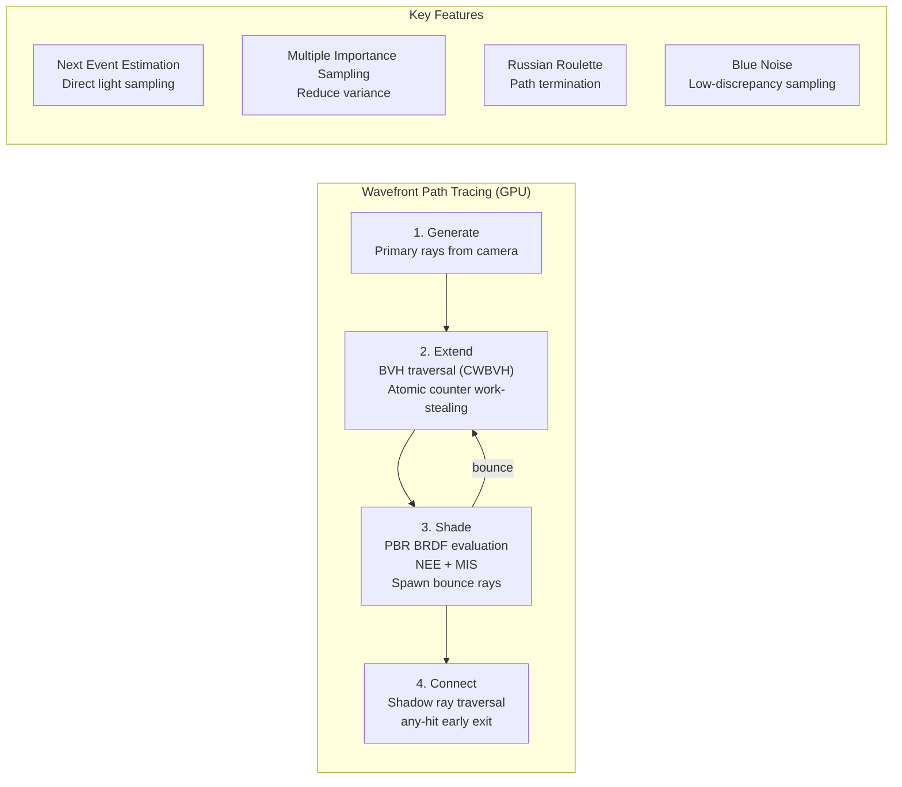

#### Wavefront Architecture (from Jacco Bikker / TinyBVH wavefront.cl)

The GPU path tracer follows the streaming wavefront pattern with 4 kernels per bounce:

1. **Generate**: Create primary camera rays. Store in `ray_buffer`. Initialize path state (throughput = 1, depth = 0).
2. **Extend**: Traverse BVH for all active rays. Uses atomic counter for dynamic work distribution (no idle threads). Write intersections to `intersection_buffer`.
3. **Shade**: For each hit:
   - Evaluate PBR BRDF (Cook-Torrance)
   - Sample direct light (NEE) → generate shadow ray → push to `shadow_ray_buffer`
   - Sample BRDF for next bounce → update throughput → push to `ray_buffer`
   - Russian Roulette termination after depth ≥ 3
   - For misses → sample environment map → accumulate contribution
4. **Connect**: Trace shadow rays (any-hit). If unoccluded → add direct light contribution to pixel accumulator.

Repeat Extend→Shade→Connect for each bounce depth (typically 3-8 bounces).

#### Materials

| Property | Source | Usage |
|----------|--------|-------|
| Albedo (color + texture) | `MaterialData` (already extracted) | Diffuse BRDF, refraction color |
| Metallic | `MaterialData` ✅ used | F0 value: `mix(0.04, albedo, metallic)` |
| Roughness | `MaterialData` ✅ used | GGX distribution width |
| Specular | `MaterialData` ✅ used | Dielectric F0 scaling |
| Emission | `MaterialData` (stored, unused) | Self-illumination, light sources |
| Normal map | `MaterialData` ✅ extracted + applied | Perturbed shading normal via TBN |

#### Expected Visual Impact

| Feature | Before | After |
|---------|--------|-------|
| Reflections | None | Accurate recursive reflections on metals/glass |
| Color bleeding | None | Indirect light bounce between surfaces |
| Ambient occlusion | None / SSAO | Ground-truth contact darkening |
| Soft shadows | Hard (Phase 1) | Area light penumbra |
| Glass/water | Opaque | Refraction + caustics |

---

### Phase 4 — Denoising

> **Goal**: Turn noisy 1-4 spp path traced output into clean images at interactive rates.

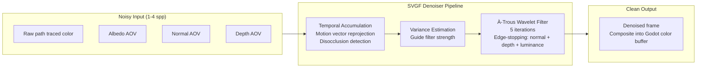

#### SVGF (Spatiotemporal Variance-Guided Filtering)

The industry-standard real-time denoiser. Used by every production path tracer (Lighthouse 2, NVIDIA RTXGI, etc.):

1. **Temporal accumulation**: Reproject previous frame's result using motion vectors. Detect disocclusion (no valid history) and reduce history length there.
2. **Variance estimation**: Compute per-pixel luminance variance from temporal history. High variance = more aggressive spatial filtering.
3. **À-trous wavelet filter**: Iterative spatial filter (5 passes) with increasing step size (1, 2, 4, 8, 16 pixels). Edge-stopping functions prevent blurring across depth/normal discontinuities. Variance guides filter kernel width.

**Alternative**: A-SVGF (Adaptive SVGF) — adds gradient-based confidence estimation for even better temporal stability.

#### Performance Budget (1080p, GTX 1650 Ti)

| Pass | Cost |
|------|------|
| Temporal accumulation | ~0.3 ms |
| Variance estimation | ~0.2 ms |
| À-trous × 5 iterations | ~1.5 ms |
| **Total** | **~2.0 ms** |

---

### Phase 5 — Production Ship

> **Goal**: Make the ray tracer game-ready with dynamic scene support,
> performance scaling, and async operation.

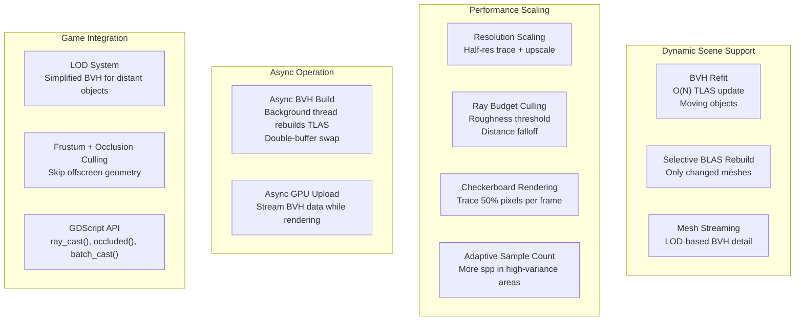

#### Resolution Scaling Strategy

| Quality | Trace Resolution | Upscale | Target |
|---------|-----------------|---------|--------|
| Low | 25% (480×270) | Bilinear | 60 fps on integrated |
| Medium | 50% (960×540) | CAS | 60 fps on GTX 1650 Ti |
| High | 75% (1440×810) | CAS | 60 fps on RTX 3060 |
| Ultra | 100% (1920×1080) | None | 60 fps on RTX 4070+ |

---

## Landscape Analysis

### Similar Projects & What We Learn From Them

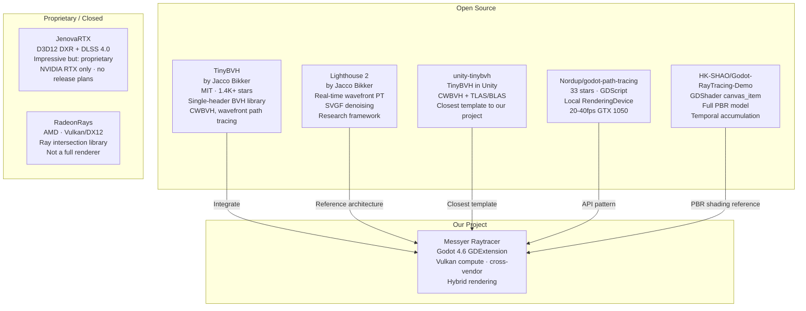

### JenovaRTX Deep Dive (Why We Can't Use It)

| Aspect | JenovaRTX | Our Approach |
|--------|-----------|--------------|
| **License** | Proprietary, unreleased | MIT / open |
| **GPU API** | D3D12 DXR (hardware RT) | Vulkan compute (software RT) |
| **GPU Requirement** | NVIDIA RTX 2060+ (RT cores + Tensor cores) | Any Vulkan GPU |
| **Platform** | Windows only | Windows + Linux (+ Mac planned via MoltenVK) |
| **DLSS** | 4.0 + Ray Reconstruction | Not available (can use CAS or FSR) |
| **Architecture** | Separate D3D12 device → Vulkan texture share | Native Vulkan within Godot |
| **Availability** | "No release plans" per author | Fully under our control |

**What we learn from JenovaRTX's architecture**:
- `RTXWorld` → `RTXMeshInstance` → `RTXMaterial` node hierarchy with rasterizer fallback — good API pattern
- D3D12 → Vulkan shared GPU memory texture (`RTXPass`) — creative but platform-locked
- `RTXBridge` singleton for managing TLAS/BLAS/BVH lifecycle — similar to our `RayTracerServer`

### Key Takeaway

> We are the only project building a **cross-vendor Vulkan compute** path tracer
> as a **Godot GDExtension in C++**. TinyBVH provides the BVH engine; Lighthouse 2
> provides the architecture reference; unity-tinybvh provides the integration template.

---

## CompositorEffect Technical Reference

> Patterns extracted from [JFA motion blur addon](https://github.com/sphynx-owner/JFA_driven_motion_blur_addon) (338★)
> and [lens effects compositor](https://github.com/ARez2/compositor-effect-lens-effects) (21★).

### G-Buffer Access

| Buffer | Access Method | Format |
|--------|--------------|--------|
| Color | `render_scene_buffers.get_color_layer(view)` | `R16G16B16A16_SFLOAT` |
| Depth | `render_scene_buffers.get_depth_layer(view)` | `R32_SFLOAT` (0=near, 1=far) |
| Normal + Roughness | `render_scene_buffers.get_texture("forward_clustered", "normal_roughness")` | `RGBA8` (oct-encoded RG, roughness B) |
| Scene Data UBO | `render_scene_data.get_uniform_buffer()` | Camera matrices, projection |

### Initialization Pattern

```
CompositorEffect._init()
  → Set effect_callback_type (POST_TRANSPARENT)
  → RenderingServer.call_on_render_thread(_initialize_compute)

_initialize_compute():
  → rd = RenderingServer.get_rendering_device()   // SHARED device
  → Create samplers (nearest + linear)
  → Load GLSL → get_spirv → shader_create_from_spirv → pipeline_create
```

### Render Callback Pattern

```
_render_callback(effect_callback_type, render_data):
  → scene_buffers = render_data.get_render_scene_buffers()
  → scene_data = render_data.get_render_scene_data()
  → render_size = scene_buffers.get_internal_size()
  → For each view:
      color = scene_buffers.get_color_layer(view)
      depth = scene_buffers.get_depth_layer(view)
      normal = scene_buffers.get_texture("forward_clustered", "normal_roughness")
      Dispatch compute → result written directly into color buffer
```

### Texture Management

```
// Create intermediate textures (auto-managed lifetime)
scene_buffers.create_texture(context, name, format, usage_bits, ...)
scene_buffers.get_texture_slice(context, name, layer, mipmap, ...)
scene_buffers.clear_context(context)  // on resize
```

### Uniform Set Caching

```cpp
// Avoids recreating uniform sets every frame
uniform_set = UniformSetCacheRD::get_cache(shader, set_index, uniforms_array);
```

### Normal/Roughness Decoding (Godot's forward_clustered)

```glsl
vec3 octahedral_decode(vec2 f) {
    vec3 n = vec3(f.x, f.y, 1.0 - abs(f.x) - abs(f.y));
    float t = clamp(-n.z, 0.0, 1.0);
    n.xy += mix(vec2(t), vec2(-t), greaterThanEqual(n.xy, vec2(0.0)));
    return normalize(n);
}
```

---

## PBR & Shading Reference

### Cook-Torrance BRDF Components

**GGX Normal Distribution** ($D$):

$$D_{GGX}(\mathbf{h}) = \frac{\alpha^2}{\pi \left( (N \cdot H)^2 (\alpha^2 - 1) + 1 \right)^2}$$

**Fresnel-Schlick** ($F$):

$$F(\theta) = F_0 + (1 - F_0)(1 - \cos\theta)^5$$

**Smith Height-Correlated** ($G$):

$$G(\mathbf{l}, \mathbf{v}) = \frac{2(N \cdot L)(N \cdot V)}{(N \cdot L)\sqrt{\alpha^2 + (1 - \alpha^2)(N \cdot V)^2} + (N \cdot V)\sqrt{\alpha^2 + (1 - \alpha^2)(N \cdot L)^2}}$$

### Cosine-Weighted Hemisphere Sampling

```glsl
vec3 cosine_hemisphere_sample(vec3 normal, inout uint rng) {
    float ra = TAU * random_float(rng);
    float rb = random_float(rng);
    float rz = sqrt(rb);
    vec2 rxy = sqrt(1.0 - rb) * vec2(cos(ra), sin(ra));
    return construct_TBN(normal) * vec3(rxy, rz);
}
```

### GGX Importance Sampling

```glsl
vec3 ggx_sample(vec3 normal, float roughness, inout uint rng) {
    float a = roughness * roughness;
    float rb = random_float(rng);
    float rz = sqrt((1.0 - rb) / (1.0 + (a * a - 1.0) * rb));
    // ... TBN construction as above
}
```

### Russian Roulette (Path Termination)

```glsl
float inv_pdf = exp(float(bounce) * light_quality);
float roulette_prob = 1.0 - (1.0 / inv_pdf);
if (random_float(rng) < roulette_prob) break;
throughput /= (1.0 - roulette_prob);  // unbias
```

### Temporal Accumulation

```glsl
vec4 prev = imageLoad(accumulated, uvi);
vec4 result = prev * (frame - 1.0) / frame + new_sample / frame;
imageStore(accumulated, uvi, result);
```

---

## GPU Shader Reference

### Current Layout (bvh_traverse.comp.glsl)

```glsl
#version 450
layout(local_size_x = 128) in;

// Set 0: Scene data
layout(set = 0, binding = 0, std430) readonly buffer TriangleBuffer  { GPUTriangle[] };
layout(set = 0, binding = 1, std430) readonly buffer BVHNodeBuffer   { GPUBVHNodeWide[] };
layout(set = 0, binding = 2, std430) readonly buffer RayBuffer       { GPURay[] };
layout(set = 0, binding = 3, std430) writeonly buffer ResultBuffer   { GPUIntersection[] };

// Features: Aila-Laine wide nodes, shared memory stack (24KB),
// Möller-Trumbore intersection, specialization constants for nearest/any-hit
```

### Target Layout (CompositorEffect RT shaders)

```glsl
#version 450
layout(local_size_x = 16, local_size_y = 16) in;

// Set 0: Godot scene data
layout(set = 0, binding = 0) uniform SceneData { /* camera matrices */ };
layout(set = 0, binding = 1, rgba16f) uniform image2D color_buffer;
layout(set = 0, binding = 2) uniform sampler2D depth_sampler;
layout(set = 0, binding = 3) uniform sampler2D normal_roughness_sampler;

// Set 1: BVH data (shared device)
layout(set = 1, binding = 0, std430) readonly buffer BVHNodes     { ... };
layout(set = 1, binding = 1, std430) readonly buffer Triangles    { ... };
layout(set = 1, binding = 2, std430) readonly buffer Materials    { ... };

// Set 2: Intermediate textures
layout(set = 2, binding = 0, rgba16f) uniform image2D reflection_result;
layout(set = 2, binding = 1, rgba16f) uniform image2D prev_frame_result;

// Push constants (128 bytes max)
layout(push_constant, std430) uniform Params {
    mat4 inv_projection;
    mat4 inv_view;
    float roughness_threshold;
    float temporal_blend;
    int frame_count;
};
```

### RT Reflection Pipeline (4-pass)

```mermaid
graph LR
    subgraph Pass1["Pass 1: Trace"]
        ReadGB["Read G-Buffer:<br/>depth → world pos<br/>normal/roughness"]
        GenRay["Generate reflection ray:<br/>reflect(-view, normal)"]
        TraceBVH["Trace BVH<br/>(shared device)"]
        WriteHit["Write hit color + distance<br/>→ intermediate texture"]
    end
    subgraph Pass2["Pass 2: Spatial Denoise"]
        Bilateral["5×5 cross-bilateral filter<br/>depth + normal edge-stopping"]
    end
    subgraph Pass3["Pass 3: Temporal"]
        Reproject["Reproject previous frame"]
        Blend["Exponential moving average<br/>90% history / 10% new"]
        MotionReject["Motion rejection<br/>(depth comparison)"]
    end
    subgraph Pass4["Pass 4: Composite"]
        Fresnel["Fresnel-Schlick weighting"]
        RoughFade["Roughness falloff"]
        WriteColor["imageStore → color buffer"]
    end
    Pass1 --> Pass2 --> Pass3 --> Pass4
```

---

## Risk Register

| Risk | Impact | Likelihood | Mitigation |
|------|--------|------------|------------|
| `get_texture("forward_clustered", "normal_roughness")` changes between Godot versions | Shader breaks | Medium | Pin to Godot 4.4+, wrap in compatibility check |
| Push constant 128-byte limit exceeded | Shader won't compile | Low | Use UBO for large data, push constants only for per-frame camera params |
| GTX 1650 Ti can't handle 1080p RT at 60fps | Unplayable | High | Roughness threshold culling, resolution scaling (50%), checkerboard, adaptive spp |
| TinyBVH CWBVH shader uses NVIDIA PTX intrinsics | AMD/Intel broken | Medium | Provide fallback BVH2 path; use `findLSB()` as GLSL equivalent of `__ffs` |
| 1 spp path tracing is too noisy | Visual artifacts | High | SVGF denoiser (proven), temporal accumulation, increase to 2-4 spp |
| BVH rebuild stalls gameplay | Frame hitches | Medium | Async BVH build on background thread, double-buffer swap |
| Texture sampling via `Image::get_pixel()` too slow for GPU | CPU bottleneck | Already true | Move textures to GPU texture arrays (Phase 3) |
| CompositorEffect BVH needs separate upload from GPURayCaster's local device | Double memory | Known | Already solved: `RTCompositorBase::upload_scene_to_shared_device()` uploads to shared device |

---

## File Map

### Current Source Tree

```
src/
├── core/
│   ├── ray.h                    # Ray struct
│   ├── intersection.h           # Hit result struct
│   ├── triangle.h               # Triangle storage
│   ├── triangle_uv.h            # Per-triangle UVs
│   ├── material_data.h          # PBR material properties
│   ├── aabb_intersect.h         # AABB-ray intersection
│   ├── asserts.h                # Tiger-style assertions
│   └── stats.h                  # Performance counters
├── accel/
│   ├── bvh.h                    # BVH builder + traversal
│   ├── mesh_blas.h              # Per-mesh BVH (BLAS)
│   ├── scene_tlas.h             # Two-level acceleration structure
│   ├── blas_instance.h          # BLAS instance (transform + ref)
│   └── ray_scene.h              # Flat scene BVH (simple path)
├── gpu/
│   ├── gpu_ray_caster.h/.cpp    # GPU compute dispatch (local device)
│   ├── gpu_structs.h            # GPU-side struct definitions
│   └── shaders/
│       ├── bvh_traverse.comp.glsl     # BVH traversal kernel (314 lines)
│       ├── rt_reflections.comp.glsl   # Reflection trace kernel
│       ├── rt_denoise_spatial.comp.glsl
│       ├── rt_denoise_temporal.comp.glsl
│       └── rt_composite.comp.glsl     # Fresnel composite kernel
├── modules/graphics/
│   ├── rt_compositor_base.h/.cpp      # CompositorEffect base class
│   ├── rt_reflection_effect.h/.cpp    # RT reflections (4-pass)
│   ├── ray_renderer.h/.cpp            # CPU debug renderer (11 AOVs)
│   ├── cpu_path_tracer.h              # CPU multi-bounce path tracer (IPathTracer impl)
│   ├── ray_image.h/.cpp               # Float pixel buffer
│   ├── ray_camera.h                   # Camera ray generation
│   ├── shade_pass.h                   # Per-pixel shading functions
│   ├── path_trace.h                   # Path tracing: NEE, bounce sampling
│   ├── path_state.h                   # Per-pixel path state (throughput, RNG)
│   └── texture_sampler.h              # CPU texture sampling
├── simd/
│   ├── ray_packet.h             # 4-ray SIMD packet
│   └── simd_tri.h               # 4-triangle SIMD intersection
├── dispatch/
│   ├── thread_pool.h            # Thread pool (11 threads)
│   ├── ray_dispatcher.h         # Tile-based dispatch
│   └── ray_sort.h               # Frame-coherent ray sorting
├── api/
│   ├── ray_service.h            # IRayService interface
│   ├── ray_query.h              # Ray query types
│   ├── path_tracer.h            # IPathTracer interface + PathTraceParams
│   ├── gpu_types.h              # GPU-compatible structs (GPUTrianglePacked, GPUBVHNodePacked, GPUSceneUpload)
│   ├── thread_dispatch.h        # IThreadDispatch interface
│   ├── light_data.h             # LightData + SceneLightData
│   └── scene_shade_data.h       # Shade data view struct
└── godot/
    ├── raytracer_server.h/.cpp  # Scene management + mesh extraction
    ├── raytracer_debug.h/.cpp   # Debug overlay + H-key toggle
    ├── raytracer_probe.h/.cpp   # GDScript ray API
    ├── ray_batch.h/.cpp         # Batched ray queries
    ├── ray_service_bridge.cpp   # API bridge
    └── register_types.h/.cpp    # GDExtension registration
```
